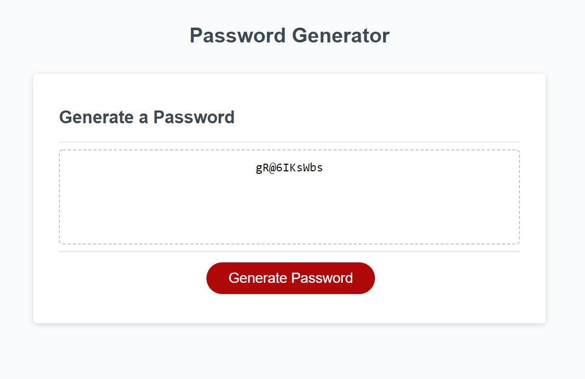

# password_generator_javascript

## Description
This is an automatic password generator. Users are promted a series of questions regarding how long they want their password to be and which type of characters they want to be in their password. This program offers a secure, unique password so users' information is secure.

## Usage
To generate a password, click generate password and then answer the 5 questions that appear on the screen. A unique and secure password will appear.

Here is a link to the password generator: https://nicolepingar.github.io/password_generator_javascript/

Below is a picture of the application:

## How to Contribute
Please find me on GitHub @nicolepingar or email me at nicolepingar@gmail.com.